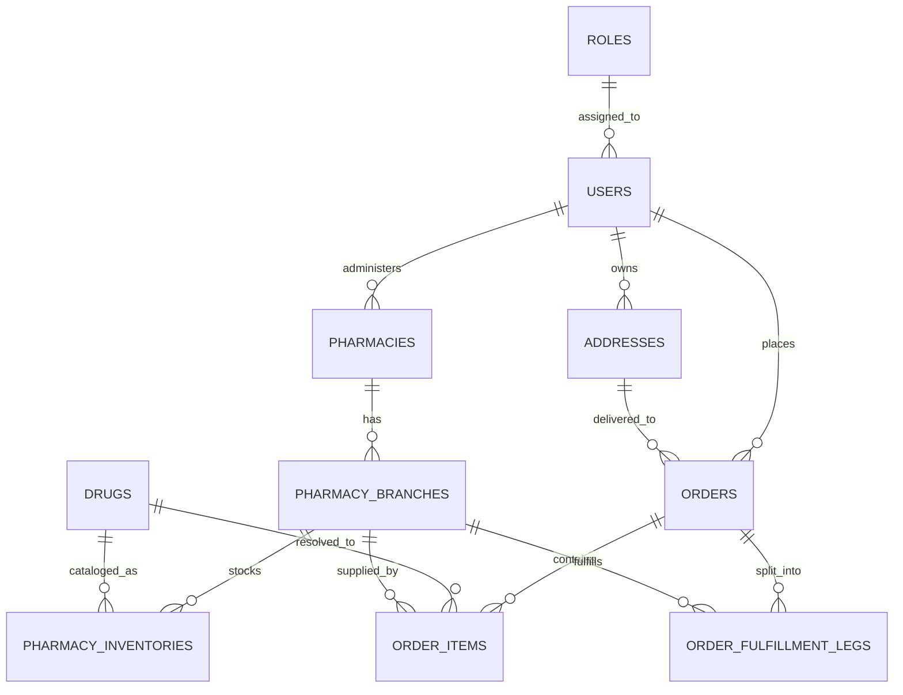

# PharmaLink Front-End

PharmaLink is a healthcare order and fulfillment platform. This repository contains the Angular front-end for the MVP and is designed around the database model below: patients register, save addresses, browse orders, and platform and pharmacist users manage inventory and fulfillment.

## Project Goal"# PharmaLink" 
# PharmaLink Front-End

PharmaLink is a healthcare order and fulfillment platform. This repository contains the Angular front-end for the MVP and is designed around the database model below: patients register, save addresses, browse orders, and platform and pharmacist users manage inventory and fulfillment.

## Project Goal

Build a role-aware user interface for three main actors:

- Patient: registers, verifies phone number, manages addresses, and places orders.
- Pharmacist: manages branch inventory and fulfillment status.
- System Admin: oversees catalog, branches, orders, and support operations.

The front-end is organized to match the backend domain model so each feature can map cleanly to an API and its related data structures.

## Domain Model Overview

The app is centered on these entities:

- Roles: defines access level and permissions.
- Users: stores identity, verification, and status data.
- Addresses: stores patient delivery locations and geolocation.
- Pharmacies and Pharmacy Branches: represent pharmacy ownership and branch coverage.
- Drugs: canonical drug catalog used across the platform.
- Pharmacy Inventories: branch stock, pricing, and reservation data.
- Orders and Order Items: patient purchase requests and line items.
- Order Fulfillment Legs: branch-level fulfillment work created after order splitting.

## Key Relationships



## Front-End Structure

The Angular app is organized by responsibility:

- `src/app/layout`: application shells such as the main layout and admin layout.
- `src/app/shared`: reusable UI pieces, directives, pipes, and utility helpers.
- `src/app/core`: app-wide concerns such as auth, guards, interceptors, services, and core models.
- `src/app/features`: feature folders grouped by business domain.

Recommended feature folders:

- `auth`: login, registration, OTP verification.
- `patient-addresses`: address management and geolocation.
- `drug-catalog`: catalog search and lookup.
- `inventory`: branch inventory management.
- `orders`: order creation, splitting, and fulfillment views.
- `admin`: platform administration screens.

## Folder Meaning

- `components`: reusable UI elements inside a layout or feature.
- `pages`: route-level screens for a feature.
- `services`: API calls and business logic for a feature.
- `models`: TypeScript interfaces and types that describe API payloads and response shapes.

Use `models` when you want a shared contract for data like `User`, `Address`, `Drug`, `Order`, or `InventoryItem`. This keeps the UI consistent with the backend schema and reduces repeated object typing.

## Getting Started

### Prerequisites

- Node.js
- npm

### Install

```bash
npm install
```

### Run the development server

```bash
npm start
```

### Build the app

```bash
npm run build
```

### Run tests

```bash
npm test
```

## Database-Driven Features

The front-end is intended to support the following flows from the data model:

- Patient self-registration and login.
- Patient address CRUD with geospatial data.
- Drug catalog search.
- Pharmacy branch inventory management.
- Patient order creation and line item intake.
- Automated order splitting and fulfillment visibility.
- Admin oversight for catalog, branch, and support actions.

## Notes For Development

- Keep route-level screens in feature `pages` folders.
- Keep reusable cards, forms, dialogs, and nav elements in `components`.
- Keep API contracts in `models`.
- Keep cross-feature UI helpers in `shared`.
- Keep auth, guards, interceptors, and global services in `core`.

## Status

This repository currently contains the front-end structure only. Business logic, API integration, and UI implementation will be added feature by feature.

Build a role-aware user interface for three main actors:

- Patient: registers, verifies phone number, manages addresses, and places orders.
- Pharmacist: manages branch inventory and fulfillment status.
- System Admin: oversees catalog, branches, orders, and support operations.

The front-end is organized to match the backend domain model so each feature can map cleanly to an API and its related data structures.

## Domain Model Overview

The app is centered on these entities:

- Roles: defines access level and permissions.
- Users: stores identity, verification, and status data.
- Addresses: stores patient delivery locations and geolocation.
- Pharmacies and Pharmacy Branches: represent pharmacy ownership and branch coverage.
- Drugs: canonical drug catalog used across the platform.
- Pharmacy Inventories: branch stock, pricing, and reservation data.
- Orders and Order Items: patient purchase requests and line items.
- Order Fulfillment Legs: branch-level fulfillment work created after order splitting.

## Key Relationships


## Front-End Structure

The Angular app is organized by responsibility:

- `src/app/layout`: application shells such as the main layout and admin layout.
- `src/app/shared`: reusable UI pieces, directives, pipes, and utility helpers.
- `src/app/core`: app-wide concerns such as auth, guards, interceptors, services, and core models.
- `src/app/features`: feature folders grouped by business domain.

Recommended feature folders:

- `auth`: login, registration, OTP verification.
- `patient-addresses`: address management and geolocation.
- `drug-catalog`: catalog search and lookup.
- `inventory`: branch inventory management.
- `orders`: order creation, splitting, and fulfillment views.
- `admin`: platform administration screens.

## Folder Meaning

- `components`: reusable UI elements inside a layout or feature.
- `pages`: route-level screens for a feature.
- `services`: API calls and business logic for a feature.
- `models`: TypeScript interfaces and types that describe API payloads and response shapes.

Use `models` when you want a shared contract for data like `User`, `Address`, `Drug`, `Order`, or `InventoryItem`. This keeps the UI consistent with the backend schema and reduces repeated object typing.

## Getting Started

### Prerequisites

- Node.js
- npm

### Install

```bash
npm install
```

### Run the development server

```bash
npm start
```

### Build the app

```bash
npm run build
```

### Run tests

```bash
npm test
```

## Database-Driven Features

The front-end is intended to support the following flows from the data model:

- Patient self-registration and login.
- Patient address CRUD with geospatial data.
- Drug catalog search.
- Pharmacy branch inventory management.
- Patient order creation and line item intake.
- Automated order splitting and fulfillment visibility.
- Admin oversight for catalog, branch, and support actions.

## Notes For Development

- Keep route-level screens in feature `pages` folders.
- Keep reusable cards, forms, dialogs, and nav elements in `components`.
- Keep API contracts in `models`.
- Keep cross-feature UI helpers in `shared`.
- Keep auth, guards, interceptors, and global services in `core`.

## Status

This repository currently contains the front-end structure only. Business logic, API integration, and UI implementation will be added feature by feature.
